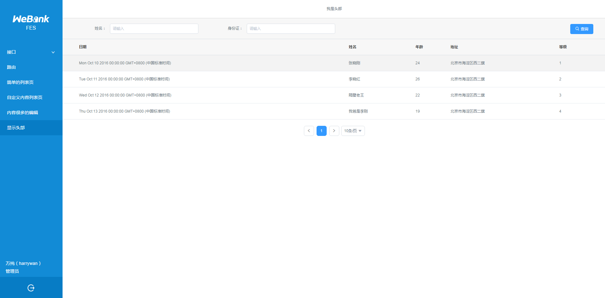

# 布局
Fes设计的布局方式有两种，水平布局和垂直布局。

## 水平布局

默认为水平布局，在`fes.config.js`中配置：
```js
export default {
    mode: 'vertical'
}
```


## 垂直布局

垂直布局，横向空间更大。配合[Menu](/ui/menu)组件使用，可实现多级菜单。在`fes.config.js`中配置：
```js
export default {
    mode: 'horizontal'
}
```

## 内置布局类组件
fes-ui 以及 `FesRouteMenu`，`FesSearchPanel`，`FesListPanel`

